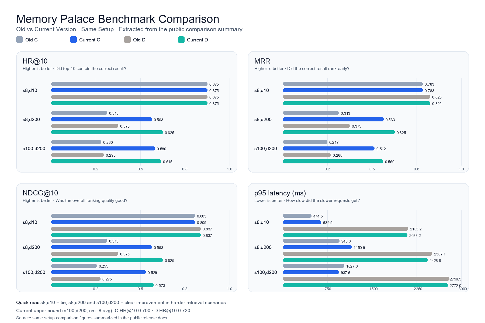

# Release Notes / Change Summary (Relative to Old Project)

> Comparison Targets:
>
> - Old Project: `<old-repo>/Memory-Palace`
> - Current Project: `Memory-Palace`
>
> Note:
>
> - This document only covers content that has been **landed and verified**.
> - Original benchmark logs, periodic retest drafts, and maintenance notes are intended for use during the maintenance phase by default; what is preserved here is the human-readable conclusion version.
> - For Windows paths, it is still recommended to perform manual re-verification following the same steps in the target Windows environment.

---

## 1. One-Sentence Conclusion

Compared to the old project, the current version has been upgraded from a "usable long-term memory service" to a version that is "**more complete in skills/MCP, more stable in deployment, stricter in validation, and stronger in high-interference retrieval scenarios**."

---

## 2. Changes Most Noticeable to Users

| Change | What was specifically done | Effect on User | Code / Test Anchors |
|---|---|---|---|
| `skills + MCP` Productization | Completed canonical bundle, installation scripts, synchronization scripts, smoke tests, and live e2e | No longer just "having tools," but "knowing how to install, check, and verify" | `scripts/install_skill.py`, `scripts/sync_memory_palace_skill.py`, `scripts/evaluate_memory_palace_mcp_e2e.py`, `backend/tests/test_mcp_stdio_e2e.py` |
| More Stable Docker Deployment | Added deployment locks to one-click scripts; changed runtime injection to explicit opt-in | Avoids configuration conflicts from multiple deployments and reduces accidental inclusion of local environments in release packages | `scripts/docker_one_click.sh`, `scripts/docker_one_click.ps1` |
| More Verifiable Benchmarks | Changed real runner to a unique workdir and added concurrency isolation tests | Benchmarks are less likely to contaminate each other's results during multiple runs | `backend/tests/benchmark/helpers/profile_abcd_real_runner.py`, `backend/tests/benchmark/test_profile_abcd_real_runner.py` |
| New System URIs / Retrieval Compatibility | Added `system://audit`, `system://index-lite`, `include_ancestors`, `scope_hint` | Clearer debugging, auditing, and recall paths; smoother client workflows | `backend/mcp_server.py`, `backend/tests/test_system_uri_audit_index_lite.py`, `backend/tests/test_read_memory_include_ancestors.py`, `backend/tests/test_search_memory_scope_hint_compat.py` |
| Completed Import / Explicit Learning Pipeline | Added interfaces and protection logic for import, learn, and rollback | Clearer space for future expansion while remaining conservative by default | `backend/api/maintenance.py`, `backend/tests/test_external_import_api_prepare.py`, `backend/tests/test_auto_learn_explicit_service.py` |

---

## 3. Most Significant Improvements Compared to Old Project

### 3.1 Retrieval Quality

In control scenarios prone to interference, the current version shows significant improvements in the C and D tiers:

First, let's clarify the metrics:

- **HR@10**: Whether the correct result was found within the top 10.
- **MRR**: How high the correct result is ranked.
- **NDCG@10**: The overall quality of the ranking.

If you just want to quickly judge "whether the new version is stronger," prioritize looking at **HR@10**.

  

> 📈 This chart is the highlight: direct comparison of quality and latency between the old version and the current version under the same parameters.

| Scenario | Metric | Old C | New C | Old D | New D |
|---|---|---:|---:|---:|---:|
| `s8,d10` | `HR@10` | 0.875 | 0.875 | 0.875 | 0.875 |
| `s8,d10` | `MRR / NDCG@10` | 0.783 / 0.805 | 0.783 / 0.805 | 0.825 / 0.837 | 0.825 / 0.837 |
| `s8,d200` | `HR@10` | 0.313 | 0.563 | 0.375 | 0.625 |
| `s8,d200` | `MRR / NDCG@10` | 0.313 / 0.313 | 0.563 / 0.563 | 0.375 / 0.375 | 0.625 / 0.625 |
| `s100,d200` | `HR@10` | 0.280 | 0.580 | 0.295 | 0.615 |
| `s100,d200` | `MRR / NDCG@10` | 0.247 / 0.255 | 0.512 / 0.529 | 0.268 / 0.275 | 0.560 / 0.573 |

Additional notes:

- In the low-difficulty scenario `s8,d10`, results are **equivalent**, not exaggerated.
- Improvements in high-interference scenarios are intuitive:
  - `s8,d200`: C tier `HR@10` increased from `0.313` to `0.563`, D tier from `0.375` to `0.625`.
  - `s100,d200`: C tier `HR@10` increased from `0.280` to `0.580`, D tier from `0.295` to `0.615`.
- In `s8,d10 / s8,d200 / s100,d200`, `s` is the sample size and `d` is the number of distractor documents; a larger `d` indicates a harder scenario.
- Only summary figures are kept here; detailed retesting notes are reserved for the maintenance phase.

### 3.2 Latency Observations

The main conclusion of this comparison is that **quality is significantly improved**, not that "latency is lower in all scenarios."

`p95` can be simply understood as:

- Out of 100 requests, the latency of the slowest 5.
- Therefore, it is closer to the user's actual experience of "peak latency."

| Scenario | Repo | C p95(ms) | D p95(ms) |
|---|---|---:|---:|
| `s8,d10` | Old | 474.5 | 2103.2 |
| `s8,d10` | New | 639.5 | 2088.2 |
| `s8,d200` | Old | 945.8 | 2507.1 |
| `s8,d200` | New | 1150.9 | 2428.8 |
| `s100,d200` | Old | 1027.8 | 2796.5 |
| `s100,d200` | New | 937.6 | 2772.0 |

How to interpret this table:

- The value of the new version is primarily in **higher recall in harder scenarios**.
- In scenarios like `s100,d200`, which are closer to real-world complex retrieval, latency did not significantly degrade.
- Thus, it's more accurate to say "**stronger quality, with overall latency remaining within an acceptable range**," rather than simply "faster."

### 3.3 Enhancement Ceiling for New Version (Supplemental)

In the same `s100,d200` scenario, after increasing `candidate_multiplier` from `4` to `8`, the mean of 3 repetitions was:

- C: `HR@10=0.700`, `MRR=0.607`, `NDCG@10=0.630`
- D: `HR@10=0.720`, `MRR=0.651`, `NDCG@10=0.668`

These numbers indicate:

- The new version is not just "stronger under equal parameters."
- Given a larger candidate pool, it has room for further improvement.
- The tradeoff is higher latency in the D tier, making it suitable for "**tunable quality/latency tradeoffs based on business scenarios**."

Let's briefly explain `candidate_multiplier`:

- it determines how many candidate results are pulled in the first round before subsequent ranking.
- Usually, a higher value provides a better chance for quality improvement.
- But the cost is direct: slower performance and more computation.

### 3.4 Deployment and Release

- The old version was more about "getting the service running"; the new version emphasizes "stable releases."
- There is now a `scripts/pre_publish_check.sh` for repository health checks before sharing or releasing.
- It is safer to re-run corresponding in-repo tests and minimal startup checks after major changes.

### 3.5 Client Integration

- The old version mostly stopped at "having MCP / skill descriptions."
- The new version completes the installation, synchronization, and verification chain for `Claude / Codex / Gemini / OpenCode`.
- Boundaries are also clearly defined: `Gemini live` has not reached a "complete pass" level, and `Cursor / Antigravity` still require manual steps.

---

## 4. What Actually Hasn't Changed

- The frontend main page still features four core entry points: `Memory / Review / Maintenance / Observability`.
- The MCP main toolset remains at **9 tools**.
- The core architecture of FastAPI + SQLite + React has not been overhauled.

This means: **Old users will still recognize the project, but will notice it is "stabler, clearer, and easier to validate."**

---

## 5. Current Public Validation Scope

### 5.1 Explicitly Verified

- `scripts/pre_publish_check.sh` exists and is executable.
- MCP stdio live e2e reports as `PASS`.
- `Claude / Codex / OpenCode / Gemini` all have smoke test results.
- The `macOS + Docker` path is completed with startup and smoke test instructions in the public documentation.

### 5.2 Still Requires Conservative Representation

- `Gemini live`: Currently not fully passed.
- `Cursor / agent / Antigravity`: Currently marked as `PARTIAL`.
- Windows: Still recommended to re-verify in the target environment.

---

## 6. Recommended External Messaging

It is suggested to write it this way:

> The current version has completed a round of consolidation based on actual code, scripts, and test results.  
> Compared to the old project, the biggest changes include more complete `skills/MCP`, more stable deployment gates, more verifiable benchmarks, and better performance in high-interference retrieval scenarios.  
> Current public documentation only guarantees verified paths; if your target environment is Windows, please run the same startup and smoke tests in the target environment.

It is NOT suggested to write it this way:

- "All clients are completely out-of-the-box ready."
- "Native final verification has been completed for all platforms."
- "Proved absolutely free of hidden bugs."

---

## 7. Key Implementation Anchors

- `skills/MCP` Installation and Sync: `scripts/install_skill.py`, `scripts/sync_memory_palace_skill.py`
- live MCP e2e: `scripts/evaluate_memory_palace_mcp_e2e.py`, `backend/tests/test_mcp_stdio_e2e.py`
- Deployment Lock: `scripts/docker_one_click.sh`, `scripts/docker_one_click.ps1`
- Pre-share/Pre-publish Self-check: `scripts/pre_publish_check.sh`
- Benchmark Isolation: `backend/tests/benchmark/helpers/profile_abcd_real_runner.py`
- Review Error Semantics: `backend/api/review.py`
